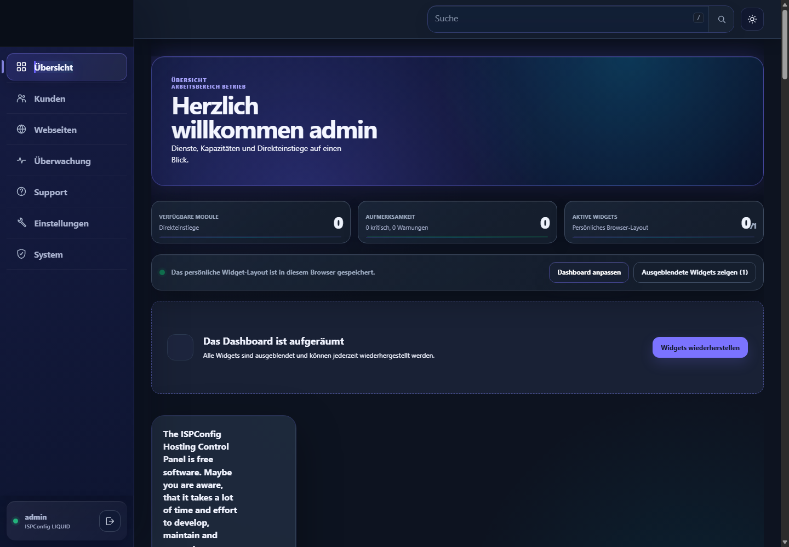

# ISPConfig Theme LIQUID

## Deutsch

LIQUID ist ein Dark-First-Liquid-Glass-Theme für ISPConfig. Es verbindet eine
konzentrierte Administrationsoberfläche mit geschichteten Flächen, dezenter
Tiefe, leuchtenden Statushinweisen und einem responsiven Komponentensystem.

Die Abbildung ist eine echte Laufzeitaufnahme der installierten
stabilen Version `v1.2.4` auf ISPConfig 3.3.1p1. Sie ist kein Konzept-Rendering.

Weitere echte Laufzeitaufnahmen:

- [Login](docs/images/login-runtime-v1.2.4.png)
- [Tabellenansicht](docs/images/table-runtime-v1.2.4.png)
- [Formular](docs/images/form-runtime-v1.2.4.png)
- [Mobile Navigation](docs/images/mobile-navigation-runtime-v1.2.4.png)

### Warum LIQUID entstanden ist

Komplexe Infrastruktur muss nicht technisch zerklüftet wirken. LIQUID verfolgt
eine eigenständige, hochwertige Designsprache, ohne Lesbarkeit oder
Betriebssicherheit den Effekten unterzuordnen. Glaseffekte bleiben auf
strukturelle Flächen begrenzt; Daten, Warnungen, Formulare und Aktionen behalten
klare Kontraste und vorhersehbares Verhalten.

### Verbesserungen

- Einheitliche Hierarchie in den unterstützten Modulen
- Dark-First-Oberfläche mit abgestimmtem hellen Farbschema
- Klare Navigation, Statusdarstellung und Schnellaktionen
- Einheitliche Tabellen, Filter, Formulare, Dialoge und Seitennavigation
- Responsive Darstellung für Desktop, Tablet und Smartphone
- Zurückhaltende Bewegung und Tiefe mit Reduced-Motion-Unterstützung
- Konfigurierbares Branding und Akzentfarben
- Getrennte Farben für Erfolg, Warnung und Gefahr
- Eigenständiges Theme-Paket ohne Änderung des ISPConfig-Kerns

### Aktueller Status und Kompatibilität

`v1.2.4` ist die aktuelle stabile Wartungsversion:

- ISPConfig 3.3.1p1
- PHP 8.1 oder neuer
- Aktuelle Desktop- und Mobilbrowser
- Ubuntu 22.04/24.04 und Debian 12/13 mit Apache und Nginx geprüft

Die vollständige Laufzeitmatrix, Admin-, Reseller-, Kunden- und
Mailuser-Ansichten sowie die visuellen Desktop-, Tablet- und Mobilprüfungen
sind bestanden. Version 1.2.4 ergänzt vollständige mobile Dashboard-Labels,
bereinigt die öffentlichen Paketmetadaten und dokumentiert die optionale
systemweite Anmeldeseite. Der unveränderliche Tag `v1.2.4` bezeichnet genau
diesen geprüften Quellstand; ältere Tags bleiben unverändert erhalten.

### Installation und Projektinformationen

- [Installation auf Deutsch](docs/INSTALLATION-DE.md)
- [Kompatibilität und Prüfbereich](docs/COMPATIBILITY.md)
- [Freigabekriterien für Version 1.2.4](docs/RELEASE-GATE-1.2.4.md)
- [Branding-Anleitung](docs/BRANDING-DE.md)
- [Änderungsprotokoll](CHANGELOG.md)
- [Sicherheitsrichtlinie](SECURITY.md)
- [Mitwirken](CONTRIBUTING.md)

### Lizenz

LIQUID ist unter der
[PolyForm Free Trial License 1.0.0](LICENSE.md) source-available. Das Theme darf
weniger als 32 aufeinanderfolgende Kalendertage evaluiert werden.
Produktive Nutzung, fortgesetzte Nutzung nach dem Testzeitraum, Managed Hosting
und andere kommerzielle Nutzung benötigen eine separate kommerzielle Lizenz.
Die Testlizenz erlaubt keine Weiterverteilung.

Von ISPConfig abgeleitete Bestandteile behalten ihre ursprünglichen
BSD-3-Clause-Hinweise in den
[Hinweisen zu Drittbestandteilen](THIRD_PARTY_NOTICES.md).

ISPConfig und die zugehörigen Marken gehören ihren jeweiligen Inhabern. Dieses
unabhängige Projekt ist weder mit ISPConfig verbunden noch von ISPConfig
offiziell empfohlen.

---

## English

LIQUID is a dark-first liquid-glass theme for ISPConfig. It combines a focused
administration layout with layered surfaces, subtle depth, luminous status
cues and a responsive component system.

The image is an actual runtime capture of stable version `v1.2.4` on
ISPConfig 3.3.1p1. It is not a concept rendering.

More actual runtime captures:

- [Login](docs/images/login-runtime-v1.2.4.png)
- [Table view](docs/images/table-runtime-v1.2.4.png)
- [Form](docs/images/form-runtime-v1.2.4.png)
- [Mobile navigation](docs/images/mobile-navigation-runtime-v1.2.4.png)

### Why LIQUID was created

Complex infrastructure does not need to feel technically fragmented. LIQUID
uses a distinctive premium design language without placing effects above
legibility or operational safety. Glass effects remain limited to structural
surfaces; data, warnings, forms and actions retain clear contrast and
predictable behavior.

### Improvements

- Consistent hierarchy across supported modules
- Dark-first interface with a coordinated light scheme
- Clear navigation, status presentation and quick actions
- Unified tables, filters, forms, dialogs and pagination
- Responsive layouts for desktop, tablet and mobile
- Restrained motion and depth with reduced-motion support
- Configurable branding and accent colors
- Distinct semantic colors for success, warning and danger
- Standalone theme package without ISPConfig core modifications

### Current status and compatibility

`v1.2.4` is the current stable maintenance release:

- ISPConfig 3.3.1p1
- PHP 8.1 or newer
- Current desktop and mobile browsers
- Ubuntu 22.04/24.04 and Debian 12/13 with Apache and Nginx validated

The complete runtime matrix, administrator, reseller, customer and mail-user
views, and the visual desktop, tablet and mobile checks have passed. The
Version 1.2.4 completes mobile dashboard labels, cleans public package metadata
and documents optional system-wide sign-in styling. The immutable `v1.2.4` tag
identifies this exact validated source state; older tags remain unchanged.

### Installation and project information

- [Installation in English](docs/INSTALLATION-EN.md)
- [Compatibility and validation scope](docs/COMPATIBILITY.md)
- [Version 1.2.4 release gate](docs/RELEASE-GATE-1.2.4.md)
- [Changelog](CHANGELOG.md)
- [Security policy](SECURITY.md)
- [Contributing](CONTRIBUTING.md)

### License

LIQUID is source-available under the
[PolyForm Free Trial License 1.0.0](LICENSE.md). The theme may be evaluated for
less than 32 consecutive calendar days. Production use, continued use after
the trial, managed hosting and other commercial use require a separate
commercial license. Redistribution is not permitted by the trial license.

Parts derived from ISPConfig retain their original BSD 3-Clause notices in
[Third-party notices](THIRD_PARTY_NOTICES.md).

ISPConfig and its trademarks belong to their respective owners. This
independent project is not affiliated with or endorsed by ISPConfig.
