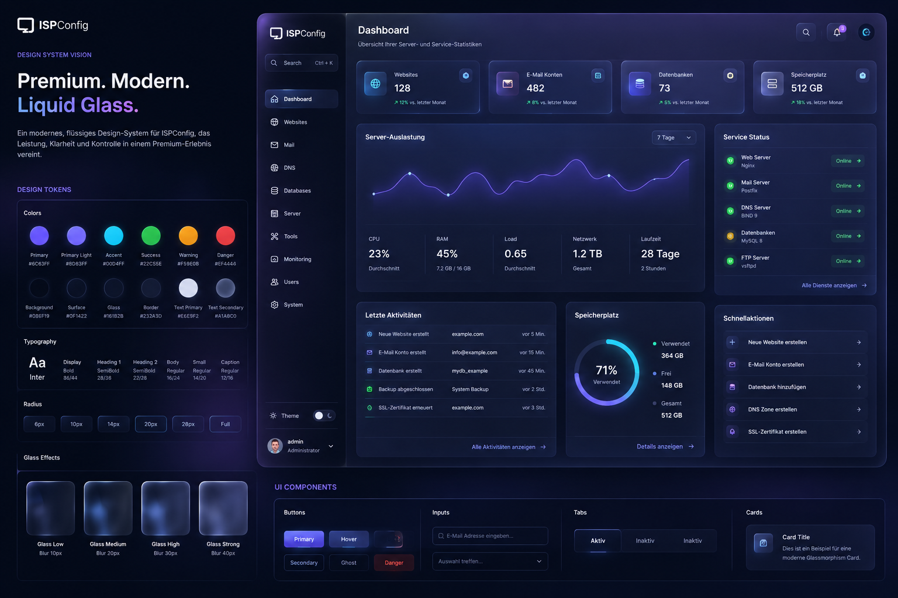

# ISPConfig Theme LIQUID

LIQUID is a dark-first liquid-glass interface theme for ISPConfig. It combines a focused administration layout with layered surfaces, subtle depth, luminous status cues and a responsive component system.

## Why LIQUID was created

Modern infrastructure products can present complex information without feeling technical or fragmented. LIQUID explores that direction for ISPConfig: a visually distinctive interface that still keeps hierarchy, legibility and operational safety ahead of effects.

The theme shares the same goal as NEXT—a coherent replacement for inconsistent legacy presentation—but offers a stronger visual identity. Glass effects are deliberately limited to structural surfaces. Data, warnings, forms and actions retain clear contrast and predictable behavior.

## What is improved

- A consistent visual hierarchy across all supported modules
- Dark-first surfaces with a coordinated light scheme
- Clear navigation, status presentation and quick actions
- Unified tables, filters, forms, dialogs and pagination
- Responsive layouts for desktop, tablet and mobile
- Restrained motion and depth with reduced-motion support
- Configurable branding and accent colors
- Distinct semantic colors for success, warning and danger
- A standalone theme package without ISPConfig core modifications

## Compatibility

- ISPConfig 3.3 development line
- PHP 8.1 or newer
- Current desktop and mobile browsers

Test the theme on a staging system before using it in production.

## Installation

- [Deutsch](docs/INSTALLATION-DE.md)
- [English](docs/INSTALLATION-EN.md)

## Project information

- [Changelog](CHANGELOG.md)
- [Security policy](SECURITY.md)
- [Contributing](CONTRIBUTING.md)

## Licensing

LIQUID is source-available under the [PolyForm Free Trial License 1.0.0](LICENSE.md). It may be evaluated for less than 32 consecutive calendar days. Production use, continued use after the trial, managed hosting and other commercial use require a separate commercial license. Redistribution is not permitted by the trial license.

Parts derived from ISPConfig retain their original BSD 3-Clause notices in [THIRD_PARTY_NOTICES.md](THIRD_PARTY_NOTICES.md). See [commercial licensing](COMMERCIAL-LICENSING.md) for the practical distinction.

ISPConfig and its trademarks belong to their respective owners. This independent project is not affiliated with or endorsed by ISPConfig.
